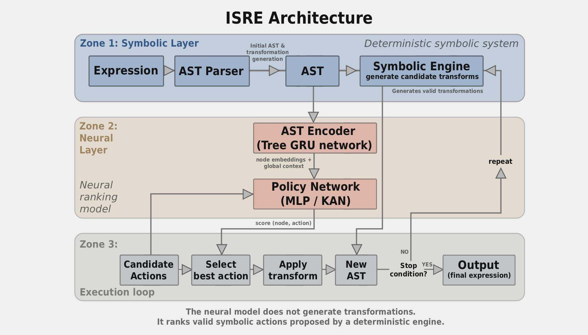
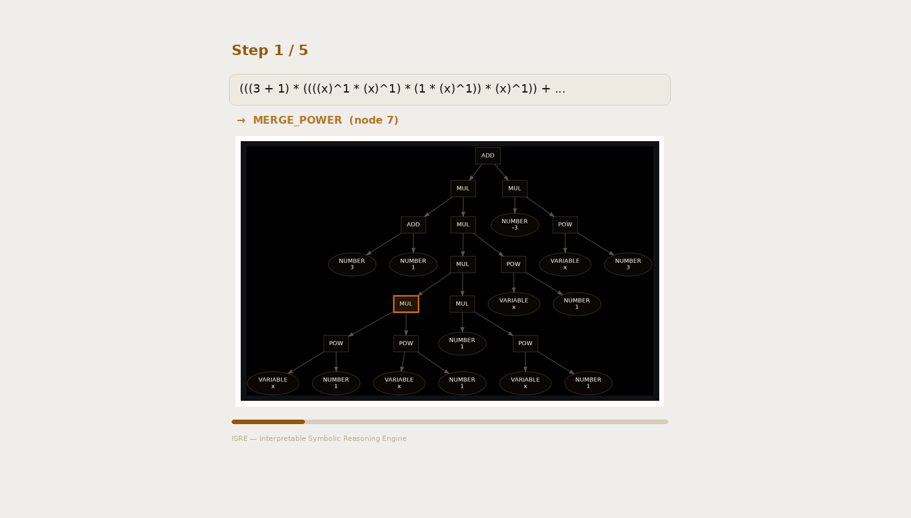

# Interpretable Symbolic Reasoning Engine (ISRE)
## Project Specification v1

**Goal:** Build an interpretable neuro-symbolic system that learns to simplify algebraic expressions via AST transformations, with emphasis on comparing architectural choices (KAN vs MLP) and diagnosing reasoning collapse.

**This is a research project, not a product.** The primary deliverable is experimental evidence about how different architectures learn local transformation rules, how interpretable those rules are, and where reasoning breaks down.

---

## 1. System Overview

```
Input AST → generate candidate transforms → policy scores actions → apply transform → new AST → repeat
```

Stop conditions: DONE action, canonical form reached, or max_steps.

---



## 2. Architecture

### 2.1 Domain Tokenizer

Grammar-based, not BPE. Token types:

```
NUMBER, VARIABLE, CONST, ADD, MUL, POW
```

v1 domain is univariate polynomials — no DIV, FUNCTION, BRACKET, or RELATION. Add when domain expands.

Output: AST.

### 2.2 AST Representation

Each node contains:

| Field | Description |
|-------|-------------|
| node_type | Operator or operand type |
| children_types | Types of immediate children |
| depth | Distance from root |
| subtree_size | Number of descendant nodes |

Example:
```
Mul
 ├─ Add(x, 1)
 └─ Add(x, 2)
```

### 2.3 Symbolic Engine

Separate deterministic module. Generates valid candidate transformations for any AST state. The neural network does NOT generate transforms — it only ranks them.

Example outputs:
```
Mul(Add, Add)  → [EXPAND]
Add(x, x)      → [COLLECT]
Pow(x, 2)      → [FACTOR]
```

Output format: `[(node_id, action)]`

### 2.4 Global AST Encoder

Architecture: bottom-up GRU-cell tree aggregation, operator-conditioned.

```
AST leaf nodes
  ↓
node embeddings (type + variable + positional)
  ↓
6× TreeAggregation blocks with residual connections
  ↓
root embedding = global context
  ↓
broadcast: node_context = concat(h_node, h_root) for each node
```

**TreeAggregation block internals:**

Node update function:
```
h_node = GRU(W_self · x_node, W_op[type(node)] · agg(children))
```

Operator-aware aggregation:
- Commutative ops (Add, Mul): `mean(children) + max(children)` (element-wise)
- Non-commutative ops (Pow): `concat(left, right)`
- Arity > 2: `positional_projection + sum`

Residual: layer-wise, `h_node_out = GRU(...) + h_node_in`.

**Depth constraint:** 6 layers covers AST depth ≤ 6. Dataset generation must enforce this limit.

**Future work:** Operator-aware Tree KAN encoder (replace GRU aggregation with KAN — potential research contribution).

### 2.5 Policy Network

Input: `concat(node_embedding, global_context, action_embedding)`

Output: `score(node, action)` — scalar.

Two variants for comparison:

| Variant | Architecture | Purpose |
|---------|-------------|---------|
| MLP baseline | 3 layers, hidden_dim 256 | Baseline, implement first |
| KAN | 2–3 layers, hidden_dim 256 | Interpretability experiments |

**KAN rationale:** Inputs are low-dimensional, semantically clean AST features. KAN approximates `score ≈ Σ φ_i(x_i)` where each `φ_i` is a learnable univariate function. This produces inspectable curves showing how node_type, depth, subtree_size, and action_type each contribute to scoring. Effectively a differentiable rule table with soft generalization boundaries.

**Critical:** Keep policy head small (8–10M params) to preserve interpretability. A 45M policy head in 6 KAN layers loses the interpretability advantage entirely.

### 2.6 Parameter Budget

| Component | Parameters | Notes |
|-----------|-----------|-------|
| Node embeddings | ~3M | type + variable + action embeddings |
| Feature projection | ~5M | node_features → hidden_dim (512) |
| Global AST encoder | ~35–40M | 6-layer operator-conditioned GRU tree aggregation |
| Policy head (KAN or MLP) | ~8–10M | 2–3 layers, dim 256 — kept small for interpretability |
| Output head | ~2M | score(node, action) |
| **Total** | **~55–65M** | |

Fits on 1× RTX 4070. Training time: hours per run. Allows 10–20 ablation variants.

Phased scaling:
- **Prototype:** 10–20M params. Verify pipeline, convergence, architecture.
- **Research:** 55–65M. Full experiments.
- **Upper bound:** 300–500M. Only after dataset and architecture are validated.

---

## 3. Training

### 3.1 Objective

Supervised cross-entropy over candidate actions, using ground-truth next action from backward-generated trajectories.

Ranking loss: deferred to v2.
RL (value network, MCTS): deferred to v2.

### 3.2 Curriculum

Phase 1: trajectory depth 1–3 only.
Phase 2: add depth 4–6 when training loss plateaus.
Phase 3: add real algebra tasks when synthetic success_rate > 80% at depth ≤ 4.

### 3.3 Training Loop

Python (PyTorch). No Rust in training path for v1.

---

## 4. Dataset

### 4.1 Domain

- Univariate polynomial algebra
- Single variable: `x`
- Coefficients: integers in [-9, 9]
- Max polynomial degree: 4
- Canonical target: collected polynomial form, sorted by degree descending
- Max AST depth: 6 (encoder constraint)

### 4.2 Generation Method

**100% backward generation for v1.**

1. Sample canonical polynomial (e.g., `3x² + 2x - 5`)
2. Convert to canonical AST
3. Apply 1–6 inverse transforms (uniform distribution across depths)
4. Record full trajectory: each intermediate AST + the forward transform that undoes the inverse
5. Extract training pairs: `(state, candidate_actions) → gold_next_action`

Forward-random samples: deferred to v2 (introduces supervision ambiguity).
Real tasks (AMC, AIME, textbook): deferred to Phase 3 of curriculum.

### 4.3 Inverse Transforms

| Transform | Weight | Constraints |
|-----------|--------|-------------|
| SPLIT_COEFFICIENT | 20% | Always binary split. k ≤ 6 |
| FACTOR_PAIR | 20% | `a` can be constant but not 1. If `a` is numeric, constrain a ≤ 3 and children to monomials/constants (ensures expand→collect is net complexity decrease). |
| UNCOLLECT_TERMS | 15% | k ≤ 3 |
| SPLIT_POWER | 15% | n ≤ 4, split into `Pow(x,a) * Pow(x,b)` where a+b=n |
| UNFLATTEN_ADD | 10% | Only if arity ≥ 3 |
| UNFLATTEN_MUL | 10% | Only if arity ≥ 3 |
| UNFOLD_CONST | 5% | Max once per subtree. Constant ≤ 10 |
| REDUNDANT_ONE | 2.5% | Max once per expression |
| REDUNDANT_ZERO | 2.5% | Max once per expression |

Distribution: ~70% semantic, ~20% structural, ~10% noise.

**UNSORT_COMMUTATIVE** is NOT a trajectory step. Applied as data augmentation: 50% chance to shuffle children of commutative nodes (Add, Mul).

**Compositional constraints:**
- No consecutive UNFOLD_CONST on same subtree
- No UNCOLLECT_TERMS immediately after SPLIT_COEFFICIENT on same node
- Post-generation validation: replay trajectory forward, verify result equals canonical form. Discard invalid trajectories.

### 4.4 Dataset Size

| Phase | Trajectories | Training pairs (approx) |
|-------|-------------|------------------------|
| Prototype (10–20M model) | 50K–100K | 200K–400K |
| Full (55–65M model) | 500K–1M | 2M–4M |

Backward generation at this scale: feasible in hours on CPU.

### 4.5 Storage Format

Per trajectory:
- `original_expression`: non-canonical starting AST
- `canonical_expression`: target form
- `trajectory`: list of (AST_state, transform_applied) tuples
- `stepwise_pairs`: list of (state, candidates, gold_action)
- `difficulty`: len(trajectory)

---

## 5. Evaluation

### 5.1 Primary Metrics

| Metric | Definition |
|--------|-----------|
| success_rate | % of expressions reaching canonical form within max_steps |
| avg_reasoning_length | Mean steps to solution (successful trajectories only) |
| invalid_action_rate | % of steps where policy selects action rejected by symbolic engine |
| loop_rate | % of trajectories containing state cycles (A→B→A) |

### 5.2 Distance Metric

**Prototype (v1):** `distance = node_count + operator_count`

Cheap, deterministic, monotonically decreasing for most simplification steps.

**Additional per-step metrics (log from day 1 — all free from backward trajectories):**

| Metric | Source | Value |
|--------|--------|-------|
| remaining_steps_to_canonical | backward trajectory | `len(trajectory) - current_step` |
| did_action_match_teacher | compare policy choice vs gold | binary per step |
| candidate_rank_of_gold_action | rank of gold action in policy's sorted output | integer (1 = model's top choice) |

These are nearly free to compute and far more diagnostic than node_count alone. `candidate_rank_of_gold_action` specifically distinguishes "model knows but isn't confident" (rank 2–3) from "model has no idea" (rank near bottom).

**Known failure cases (accepted for v1):**
- Factoring: `x² + 3x + 2` and `(x+1)(x+2)` have similar complexity but different forms
- Intermediate expansion: correct strategy sometimes increases complexity temporarily

**Mitigation for v1:** Restrict tasks to those where simplification is predominantly monotonic complexity decrease. FACTOR_PAIR is used as an inverse transform (generating expressions that need expanding), but the forward action is EXPAND, not FACTOR. FACTOR_PAIR constraints (a ≤ 3, simple children) ensure expand→collect yields net complexity decrease within 1–2 steps.

**v2 upgrade path:** Transformation distance via backward generation (exact remaining steps). Fallback to symbolic complexity for expressions where exhaustive search is infeasible.

### 5.3 Progress Tracking

For each trajectory, compute `progress(t) = distance(AST_t) / distance(AST_0)`.

Healthy trajectory: progress(t) monotonically decreasing.



### 5.4 Reasoning Collapse Taxonomy

Collapse is a **process**, not a state. It must be distinguished from simple failure (OOD, insufficient capacity).

| Type | Definition | Detection |
|------|-----------|-----------|
| INSTANT_FAILURE | progress(t) never decreases | OOD expression, not collapse |
| STALL | progress(t) plateaus after initial decrease | Strategy exhaustion |
| OSCILLATION | progress(t) oscillates (expand→factor→expand) | Cycle detection on AST states |
| LATE_COLLAPSE | progress(t) decreases then increases | True collapse — model degrades mid-reasoning |
| ENTROPY_COLLAPSE | Normalized policy entropy increases monotonically across steps | `H(policy) / log(num_candidates)` trending toward 1.0 *at constant difficulty* |

**Entropy normalization is critical.** Raw entropy is incomparable across states with different numbers of valid candidates. `normalized_entropy = H(policy) / log(num_candidates)` maps to [0, 1] regardless of candidate count. Value 1.0 = uniform (model has no preference). Entropy collapse = normalized entropy trending toward 1.0 on expressions of equal difficulty, ruling out "more candidates = higher entropy" confound.

Each type measured and compared separately across KAN vs MLP.

**Key hypothesis:** KAN's interpretable `φ_i` curves can diagnose collapse mechanism — visible transition from structured rules to degenerate patterns. MLP cannot provide this diagnostic.

---

## 6. Experiments

### Experiment 1: KAN vs MLP (central research question)

Same encoder, same data, same training. Compare:
- success_rate, reasoning_length
- Collapse taxonomy distribution
- KAN: inspect φ_i curves for interpretable rule structure

### Experiment 2: Local vs Global Context

- Policy with node features only (no global AST embedding)
- Policy with node + global context
- Measure: does global context reduce collapse? Improve long-range strategy?

### Experiment 3: Greedy vs Beam Search

- Greedy: always pick top-scored action
- Beam search (width 2–4): keep multiple candidates
- Measure: success_rate improvement, computational cost

### Experiment 4: Model Size Scaling

- 10M, 30M, 60M parameter variants
- Same architecture ratios
- Measure: where does performance saturate?

---

## 7. Debugging & Visualization Tooling

Build `trajectory_viewer.py` on day 2, alongside data generation. Not after. Every subsequent debugging session depends on it.

### 8.1 Trajectory Viewer (priority 1)

Input: `trajectory.json`. Output: HTML page.

Per step, render:
- Expression (human-readable algebraic form)
- AST (ascii tree or graphviz)
- Full ranked candidate list with scores (not just top-1)
- Gold action highlighted
- Chosen action highlighted
- `candidate_rank_of_gold_action`

Seeing the full ranked list is critical. "Gold was #2 at score 0.79" vs "gold was #5 at score 0.02" are completely different failure modes.

### 8.2 AST Visualization

Graphviz preferred (renders to SVG, embeds in HTML viewer). ASCII tree fallback for terminal debugging.

```
Mul
 ├─ Add
 │   ├─ x
 │   └─ 1
 └─ Add
     ├─ x
     └─ 2
```

### 8.3 Policy Heatmap

Per-step matrix: `node_id × action → score`. Highlight top-1 and gold. Immediately shows whether model is confident-and-wrong vs uncertain-and-close.

### 8.4 Progress Dashboard

Per-trajectory line chart:
- `distance` (node_count + operator_count)
- `normalized_entropy` (H / log(num_candidates))
- `remaining_steps` (from backward trajectory)

Stall = flat distance. Collapse = rising distance. Entropy collapse = rising normalized entropy.

```
step 0: distance 12  entropy 0.31  remaining 4
step 1: distance 9   entropy 0.28  remaining 3
step 2: distance 8   entropy 0.25  remaining 2
step 3: distance 8   entropy 0.74  remaining 2  ← stall + entropy spike
```

### 8.5 KAN φ_i Curves (week 2, after KAN implementation)

Extract and plot learned univariate functions:
- `φ_depth(x)` — how depth influences scoring
- `φ_subtree_size(x)` — how subtree size influences scoring
- `φ_action_type(x)` — per-action contribution curves

Depends on KAN library choice. pykan has built-in `plot()`. efficient-kan requires custom extraction.

---

## 8. Baselines

**Mandatory before any neural experiments:**

1. **Random policy:** Select uniformly from valid candidate actions. Establishes floor.
2. **Greedy heuristic:** Always pick action that maximally reduces `node_count + operator_count`. Establishes non-neural ceiling.
3. **BFS with depth limit:** Exhaustive search up to depth 6. Establishes optimal ceiling (for tractable expressions).

If neural policy does not beat greedy heuristic — the network adds no value. This must be demonstrated before scaling.

---

## 9. Tech Stack

### v1 (Prototype — 2 weeks)

**Everything in Python.**

- AST + symbolic engine: SymPy for parsing, custom transform logic
- Training: PyTorch
- KAN: [TBD — pykan, efficient-kan, or custom MonoKAN]
- Data generation: Python, CPU-parallelizable

### v2 (If prototype succeeds)

- AST + symbolic engine + dataset generation: rewrite in Rust for throughput
- Training: remains Python/PyTorch

Rust rewrite justified only after pipeline is validated and data generation identified as bottleneck.

---

## 10. Two-Week Plan

### Week 1: Pipeline

| Day | Deliverable |
|-----|------------|
| 1–2 | Backward data generation: canonical → inverse transforms → trajectories. Target: 50K trajectories. Build `trajectory_viewer.py` alongside — renders trajectory JSON to HTML with AST, candidates, scores. |
| 3 | AST encoder: GRU tree aggregation with operator-conditioned weights. |
| 4 | MLP policy head + training loop. Cross-entropy on (state, candidates) → gold action. |
| 5 | Baselines: random policy, greedy heuristic. First training run on 10–20M model. |

### Week 2: Experiments

| Day | Deliverable |
|-----|------------|
| 6–7 | Debug, tune hyperparameters. Verify MLP beats greedy heuristic. |
| 8 | KAN policy head implementation. Train same setup. |
| 9 | Evaluation: success_rate, collapse taxonomy, KAN φ_i curve inspection. |
| 10 | Scale to 50–65M if results are positive. Document results. |

**Hard rule:** If MLP doesn't beat greedy heuristic by day 7 — stop and diagnose. Don't proceed to KAN. The problem is in the encoder or the data, not the policy head.

---

## 11. Open Questions

1. **KAN implementation:** pykan, efficient-kan, or custom MonoKAN? Decision needed before day 8.
2. **Beam search:** Width and pruning strategy TBD after greedy results.
3. **Real task parsing:** Manual curation of 50–100 tasks vs. automated LaTeX→AST pipeline. Deferred.
4. **Value network:** AlphaZero-style policy+value for v2. Depends on v1 results.
5. **Operator-aware Tree KAN encoder:** Primary research contribution candidate. Requires v1 baseline encoder first.

---

## 12. Success Criteria

| Criterion | Threshold |
|-----------|----------|
| Pipeline works end-to-end | Training converges, loss decreases |
| Neural policy beats greedy heuristic | success_rate delta > 5% |
| KAN shows interpretable φ_i structure | Qualitative: curves correspond to recognizable algebraic rules |
| Collapse taxonomy is measurable | At least 2 distinct collapse types observed |
| Results in 2 weeks | All above achieved or clearly diagnosed why not |

---

*Spec version: 1.0*
*Last updated: March 2026*
