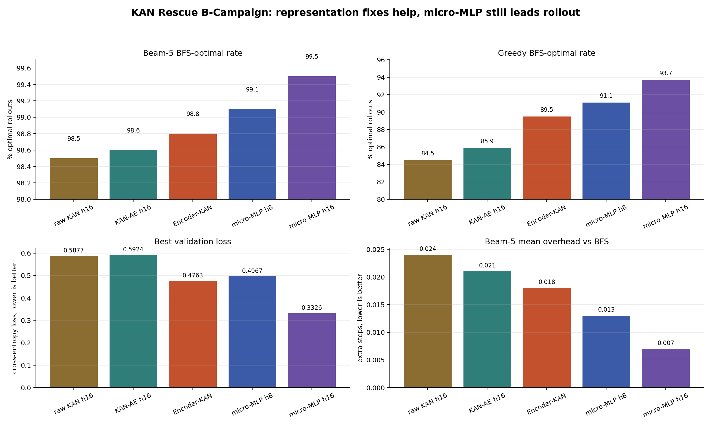

# B: KAN Rescue Results

Append-only results from the KAN rescue campaign.

Dataset/protocol:

```text
data: isre/trajectories_v7_bfs
held-out split: val_traj_ids.json, split_seed=1234
eval cap: n=2000 held-out trajectories
primary rollout metric: MODE A free rollout
```

Note: MODE B divergence categories are not meaningful in these runs because
`--recorded-data isre/trajectories_v6_recorded` was used with v7 BFS data, so
recorded-path matching is undefined. Use MODE A plus step_match/confusion only.

## Plot



## B1: Action-Embedding KAN h16 seed0

Checkpoint:

```text
leaderboards/v7/B_KAN_RESCUE/checkpoints_kan_ae_h16_s0/best.pt
```

Training:

```text
Policy: KAN-AE width=[35,16,1] action_emb=8
Policy params: 5,840
Best val loss: 0.5924
Final val acc: 0.777
Final avg_gold_rank: 1.35
```

Greedy eval:

```text
success_rate:      2000/2000 = 100.0%
overhead mean:     0.234
overhead p95:      2
bfs_optimal_rate:  85.9%
catastrophic_rate: 1.0%
step_match:        4700/5917 = 79.4%
```

Beam-5 eval:

```text
success_rate:      2000/2000 = 100.0%
overhead mean:     0.021
overhead p95:      0
bfs_optimal_rate:  98.6%
catastrophic_rate: 0.0%
step_match:        4700/5917 = 79.4%
```

Interpretation:

Action embedding slightly helps rollout compared with raw KAN h16, especially
greedy rollout, but does not close the gap to the best micro-MLP models.

## B3: Encoder-KAN b16 h16 seed0

Checkpoint:

```text
leaderboards/v7/B_KAN_RESCUE/checkpoints_encoder_kan_b16_h16_s0/best.pt
```

Training:

```text
Policy: Encoder-KAN bottleneck=16, kan_hidden=16, action_emb=8
Encoder params: 2,024
Policy params:  3,200
Total params:   5,224
Best val loss:  0.4763
Final val acc:  0.836
Final avg_gold_rank: 1.26
```

Greedy eval:

```text
success_rate:      2000/2000 = 100.0%
overhead mean:     0.168
overhead p95:      1
bfs_optimal_rate:  89.5%
catastrophic_rate: 1.0%
step_match:        5045/5917 = 85.3%
```

Beam-5 eval:

```text
success_rate:      2000/2000 = 100.0%
overhead mean:     0.018
overhead p95:      0
bfs_optimal_rate:  98.8%
catastrophic_rate: 0.0%
step_match:        5045/5917 = 85.3%
```

Interpretation:

Encoder-KAN strongly improves the supervised signal relative to raw KAN and
KAN-AE. It also beats the large MLP-128 reference on val loss and beam-5
overhead in the current v7 ledger, while still trailing micro-MLP h8/h16/h32 on
rollout optimality.

The main diagnosis is now sharper:

```text
raw KAN weakness was partly input poverty.
ASTEncoder helps KAN a lot.
KAN head still does not fully beat the best micro-MLP heads on rollout.
```
