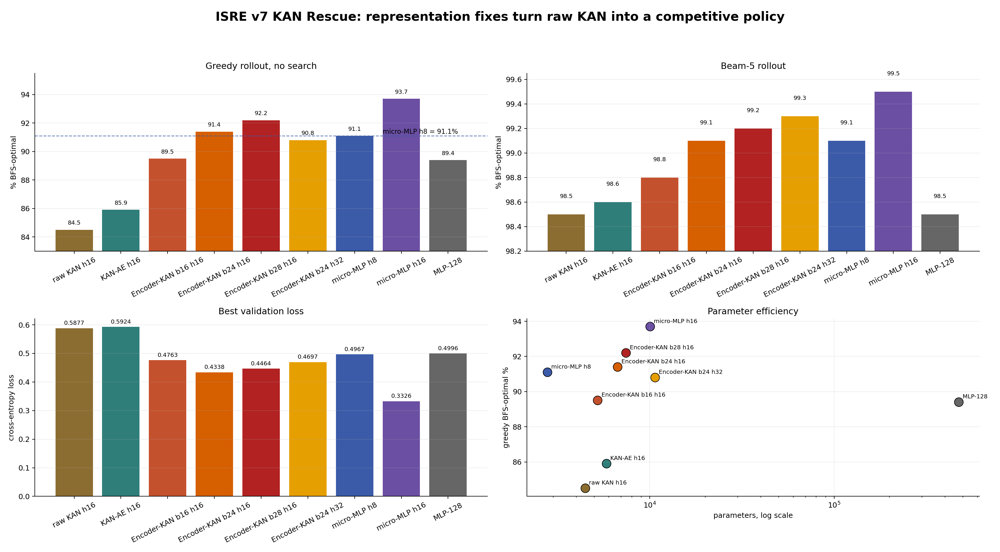
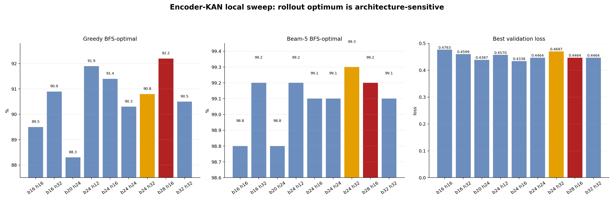

# B: KAN Rescue Results

Append-only results from the KAN rescue campaign.

Dataset/protocol:

```text
data: isre/trajectories_v7_bfs
held-out split: val_traj_ids.json, split_seed=1234
eval cap: n=2000 held-out trajectories
primary rollout metric: MODE A free rollout
```

Note: MODE B divergence categories are not meaningful in these runs because
`--recorded-data isre/trajectories_v6_recorded` was used with v7 BFS data, so
recorded-path matching is undefined. Use MODE A plus step_match/confusion only.

## Plot






## B1: Action-Embedding KAN h16 seed0

Checkpoint:

```text
leaderboards/v7/B_KAN_RESCUE/checkpoints_kan_ae_h16_s0/best.pt
```

Training:

```text
Policy: KAN-AE width=[35,16,1] action_emb=8
Policy params: 5,840
Best val loss: 0.5924
Final val acc: 0.777
Final avg_gold_rank: 1.35
```

Greedy eval:

```text
success_rate:      2000/2000 = 100.0%
overhead mean:     0.234
overhead p95:      2
bfs_optimal_rate:  85.9%
catastrophic_rate: 1.0%
step_match:        4700/5917 = 79.4%
```

Beam-5 eval:

```text
success_rate:      2000/2000 = 100.0%
overhead mean:     0.021
overhead p95:      0
bfs_optimal_rate:  98.6%
catastrophic_rate: 0.0%
step_match:        4700/5917 = 79.4%
```

Interpretation:

Action embedding slightly helps rollout compared with raw KAN h16, especially
greedy rollout, but does not close the gap to the best micro-MLP models.

## B3: Encoder-KAN b16 h16 seed0

Checkpoint:

```text
leaderboards/v7/B_KAN_RESCUE/checkpoints_encoder_kan_b16_h16_s0/best.pt
```

Training:

```text
Policy: Encoder-KAN bottleneck=16, kan_hidden=16, action_emb=8
Encoder params: 2,024
Policy params:  3,200
Total params:   5,224
Best val loss:  0.4763
Final val acc:  0.836
Final avg_gold_rank: 1.26
```

Greedy eval:

```text
success_rate:      2000/2000 = 100.0%
overhead mean:     0.168
overhead p95:      1
bfs_optimal_rate:  89.5%
catastrophic_rate: 1.0%
step_match:        5045/5917 = 85.3%
```

Beam-5 eval:

```text
success_rate:      2000/2000 = 100.0%
overhead mean:     0.018
overhead p95:      0
bfs_optimal_rate:  98.8%
catastrophic_rate: 0.0%
step_match:        5045/5917 = 85.3%
```

Interpretation:

Encoder-KAN strongly improves the supervised signal relative to raw KAN and
KAN-AE. It also beats the large MLP-128 reference on val loss and beam-5
overhead in the current v7 ledger, while still trailing micro-MLP h8/h16/h32 on
rollout optimality.

The main diagnosis is now sharper:

```text
raw KAN weakness was partly input poverty.
ASTEncoder helps KAN a lot.
KAN head still does not fully beat the best micro-MLP heads on rollout.
```

## B3 sweep: Encoder-KAN b16 h32 seed0

Checkpoint:

```text
leaderboards/v7/B_KAN_RESCUE/checkpoints_encoder_kan_b16_h32_s0/best.pt
```

Training:

```text
Policy: Encoder-KAN bottleneck=16, kan_hidden=32, action_emb=8
Encoder params: 2,024
Policy params:  5,920
Total params:   7,944
Best val loss:  0.4599
Final val acc:  0.839
Final avg_gold_rank: 1.26
```

Greedy eval:

```text
success_rate:      2000/2000 = 100.0%
overhead mean:     0.139
overhead p95:      1
bfs_optimal_rate:  90.9%
catastrophic_rate: 0.7%
step_match:        5056/5917 = 85.4%
```

Beam-5 eval:

```text
success_rate:      2000/2000 = 100.0%
overhead mean:     0.011
overhead p95:      0
bfs_optimal_rate:  99.2%
catastrophic_rate: 0.0%
step_match:        5056/5917 = 85.4%
```

Interpretation:

Widening the KAN head from h16 to h32 improves both validation loss and rollout
relative to `b16 h16`. It reaches the same beam-5 overhead as the best
micro-MLP h32 run and beats micro-MLP h8 on beam-5 optimality, but still trails
micro-MLP h8/h16/h32 on greedy optimality.

## B3 sweep: Encoder-KAN b24 h16 seed0

Checkpoint:

```text
leaderboards/v7/B_KAN_RESCUE/checkpoints_encoder_kan_b24_h16_s0/best.pt
```

Training:

```text
Policy: Encoder-KAN bottleneck=24, kan_hidden=16, action_emb=8
Encoder params: 2,024
Policy params:  4,680
Total params:   6,704
Best val loss:  0.4338
Final val acc:  0.852
Final avg_gold_rank: 1.23
```

Greedy eval:

```text
success_rate:      2000/2000 = 100.0%
overhead mean:     0.119
overhead p95:      1
bfs_optimal_rate:  91.4%
catastrophic_rate: 0.5%
step_match:        5119/5917 = 86.5%
```

Beam-5 eval:

```text
success_rate:      2000/2000 = 100.0%
overhead mean:     0.011
overhead p95:      0
bfs_optimal_rate:  99.1%
catastrophic_rate: 0.0%
step_match:        5119/5917 = 86.5%
```

Interpretation:

Removing the 24->16 bottleneck compression is a real improvement. `b24 h16`
gets the best validation loss and best greedy result among the Encoder-KAN
runs so far. This supports the bottleneck hypothesis: the earlier `b16` layer
was discarding useful encoder/action information before KAN could use it.

## B3 sweep: Encoder-KAN b32 h32 seed0

Checkpoint:

```text
leaderboards/v7/B_KAN_RESCUE/checkpoints_encoder_kan_b32_h32_s0/best.pt
```

Training:

```text
Policy: Encoder-KAN bottleneck=32, kan_hidden=32, action_emb=8
Encoder params: 2,024
Policy params:  11,440
Total params:   13,464
Best val loss:  0.4464
Final val acc:  0.847
Final avg_gold_rank: 1.25
```

Greedy eval:

```text
success_rate:      2000/2000 = 100.0%
overhead mean:     0.128
overhead p95:      1
bfs_optimal_rate:  90.5%
catastrophic_rate: 0.4%
step_match:        5110/5917 = 86.4%
```

Beam-5 eval:

```text
success_rate:      2000/2000 = 100.0%
overhead mean:     0.011
overhead p95:      0
bfs_optimal_rate:  99.1%
catastrophic_rate: 0.0%
step_match:        5110/5917 = 86.4%
```

Interpretation:

Expanding the projection to 32 and the KAN head to 32 improves validation loss
relative to `b16 h16` and `b16 h32`, but does not beat `b24 h16` on greedy
rollout. The current best Encoder-KAN point remains `b24 h16`.

## B3 sweep: Encoder-KAN b20 h24 seed0

Checkpoint:

```text
leaderboards/v7/B_KAN_RESCUE/checkpoints_encoder_kan_b20_h24_s0/best.pt
```

Training:

```text
Policy: Encoder-KAN bottleneck=20, kan_hidden=24, action_emb=8
Encoder params: 2,024
Policy params:  5,620
Total params:   7,644
Best val loss:  0.4387
Final val acc:  0.850
Final avg_gold_rank: 1.24
```

Greedy eval:

```text
success_rate:      2000/2000 = 100.0%
overhead mean:     0.173
overhead p95:      1
bfs_optimal_rate:  88.3%
catastrophic_rate: 1.1%
step_match:        5065/5917 = 85.6%
```

Beam-5 eval:

```text
success_rate:      2000/2000 = 100.0%
overhead mean:     0.016
overhead p95:      0
bfs_optimal_rate:  98.8%
catastrophic_rate: 0.0%
step_match:        5065/5917 = 85.6%
```

Interpretation:

The midpoint `b20 h24` is a useful negative result. It has good validation loss
but poor rollout compared with `b24 h16`, `b16 h32`, and `b32 h32`. Validation
loss is therefore not sufficient for selecting the best policy in this setting;
free rollout remains the primary metric.

## B3 local sweep around b24 h16

These four runs probe the neighborhood around the previous best point
`b24 h16`.

| Model | Params | Best val loss | Greedy BFS-optimal | Greedy overhead | Beam-5 BFS-optimal | Beam-5 overhead |
|---|---:|---:|---:|---:|---:|---:|
| Encoder-KAN b24 h12 | 5,704 | 0.4570 | 91.9% | 0.114 | 99.2% | 0.013 |
| Encoder-KAN b24 h24 | 8,704 | 0.4464 | 90.3% | 0.137 | 99.1% | 0.012 |
| Encoder-KAN b24 h32 | 10,704 | 0.4697 | 90.8% | 0.132 | 99.3% | 0.009 |
| Encoder-KAN b28 h16 | 7,444 | 0.4464 | 92.2% | 0.111 | 99.2% | 0.010 |

Interpretation:

The best greedy point in this local sweep is `b28 h16` at 92.2% BFS-optimal.
The best beam-5 point is `b24 h32` at 99.3% BFS-optimal and 0.009 mean
overhead. This confirms that increasing KAN-head width can help beam search,
but the strongest greedy policy still prefers a moderate KAN head with a wider
input projection.

Portfolio headline:

```text
Encoder-KAN b28 h16 reaches 92.2% greedy BFS-optimal on v7 held-out rollout
with only 7,444 parameters, outperforming micro-MLP h8 greedy (91.1%) while
remaining much smaller than MLP-128.
```
